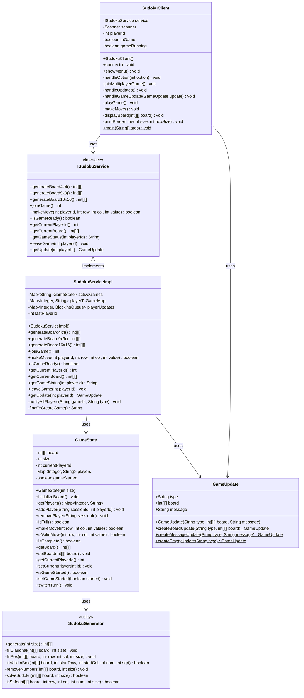

### Sudoku RMI Multiplayer
A multiplayer Sudoku game using Java RMI for game logic and WebSockets for real-time updates. The backend is built in Java, while the frontend (in development) uses React/Next.js.




## Running the Project
## 1️⃣ Start the Backend Server (RMI & WebSocket)
Open a terminal and run:

### Server
```bash
cd backend

mvn exec:java -Dexec.mainClass="com.sudoku.server.SudokuServer"

```

- This starts the RMI server and the WebSocket server.


## 2️⃣ Run the RMI Client
Open a second terminal and start a client instance:
 
 ```bash

cd backend

mvn exec:java -Dexec.mainClass="com.sudoku.client.SudokuClient"
```

- This client will connect to the RMI server and allow you to interact with the Sudoku game.

## 3️⃣ Add Another Client (Multiplayer Mode)
To simulate multiplayer, open a third terminal and run another client:

```bash

cd backend
mvn exec:java -Dexec.mainClass="com.sudoku.client.SudokuClient"
```

- This connects an additional player to the same game session.


## Architecture & Design Patterns
The project follows a distributed architecture using RMI and WebSockets:
# 1. Modelo (Model)
## Game State (GameState.java)
– Centralizes game logic, ensuring consistent updates within players.

##  (SudokuGenerator.java)
- Generates random Sudoku tables 

# 2. Servicio (Service)
## RMI Interface (ISudokuService.java)
– RMI Interface defining game operations.

## RMI (SudokuServiceImpl.java) 
– Handles core game logic (moves, turns, board state).

## GameUpdate 
- Class for messages between server and client


# 3. Server

## WebSocket (GameWebSocketServer.java)
– Notifies clients in real time about game updates.

## SudokuServer.java

- Server entry point that starts RMI and WebSocket server.

# 4 Client

## SudokuClient.java

- Client connected to server to play Sudoku


Provides UI to create/join games and interact with the game state.

Frontend (Next.js) Setup
Coming Soon: The React/Next.js client is under development. Once integrated, it will allow users to interact with the game via a browser.

🚀
